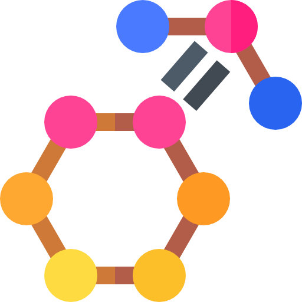
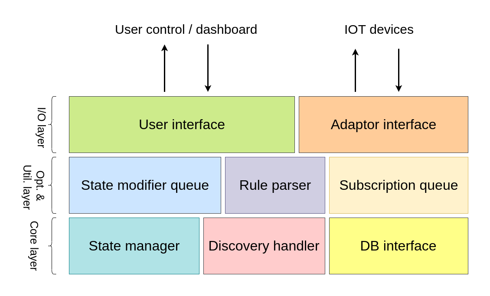

<p align="center">
  <a href="" rel="noopener">
 </a>
</p>

<h3 align="center">Lattice Hub</h3>

<div align="center">

[]()
[](https://github.com/AakashMallik/lattice-hub/issues)
[](https://github.com/AakashMallik/lattice-hub/pulls)
[](/LICENSE)

</div>

---

<p align="center"> This project is one of the three components that makes up the lattice ecosystem. The Lattice Hub is the bridging unit and the controlling box for the edge devices. Computations that are too heavy to be carried out on edge devices are dealt by Lattice Hub. It is also responsible for coordinating the other edge devices and optimizing data acquisition and command delivery.
    <br> 
</p>

## 📝 Table of Contents

- [About](#about)
- [Getting Started](#getting_started)
- [Deployment](#deployment)
- [Usage](#usage)
- [Built Using](#built_using)
- [TODO](https://github.com/AakashMallik/lattice-hub/wiki/TODO)
- [Authors](#authors)

## 🧐 About <a name = "about"></a>

The existing hubs created by Mozilla is rigid and too complex for people who whish to tinker.  

</a>

## 🏁 Getting Started <a name = "getting_started"></a>

These instructions will get you a copy of the project up and running on your local machine for development and testing purposes. See [deployment](#deployment) for notes on how to deploy the project on a live system.

### Prerequisites

The following libraries need to be installed for compiling the project from source  
- CMake
- gcc tool chain
- Boost lib

### Installing

The easiest way to get started is to build from source, but bear in mind that the OS assumed for the project may not be the same for your local machine and thus the project may fail to compile. In that case, you should resort to docker.  
  
The steps to compile from source are as follows:  
```bash
mkdir bin
cd bin
cmake ..
make
```
This should create a binary named `server`. Execute the binary with the following command:  
```bash
./server
```  
  
If you plan to use docker, which is a much better platform as it eliminates the problem of cross-compilation, then the following steps need to be followed:
```bash
docker build -t temp/lattice_hub .
```
If everything runs successfully, then create a container from the image that we just created by running the following commands:
```bash
docker run -d --name lattice_hub -p 8888:8080 temp/lattice_hub
```

To check the output go to http://localhost:8888  
  
  
The latest successful build of the app is available at Docker Hub  
[](https://hub.docker.com/repository/docker/humbled/lattice_hub)


---

## 🔧 Running the tests <a name = "tests"></a>

### Build test
The dev environment for the app is available at Docker Hub  
[](https://hub.docker.com/repository/docker/humbled/lattice_hub.dev)

This image can be used for build test using the following command:
```
docker build -t lattice_hub.test -f ./Docker/dev.Dockerfile .
```
If the build is successful the image will be created successfully which can then be run for runtime tests. 

### Break down into end to end tests

Yet to finalize

### And coding style tests

Yet to finalize

---

## 🎈 Usage <a name="usage"></a>

Yet to finalize

## 🚀 Deployment <a name = "deployment"></a>

Yet to finalize

---

## ⛏️ Built Using <a name = "built_using"></a>

- [Crow](https://github.com/ipkn/crow) - HTTP Adapter Interface

## ✍️ Authors <a name = "authors"></a>

- [@AakashMallik](https://github.com/AakashMallik) - Idea & Initial work
- [@dhirajfx3](https://github.com/dhirajfx3) - Major contributor
